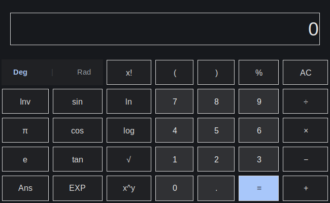

# tcl-calc

A lightweight scientific calculator with a dark, Google Calculator–inspired UI, written in Tcl/Tk.



## Features

- **Basic arithmetic** — addition, subtraction, multiplication, division, powers, and parentheses
- **Scientific functions** — sin, cos, tan, ln, log, square root, factorial, and exponentiation
- **Inverse mode** — switch to asin, acos, atan, 10^x, e^x, and x²
- **Angle modes** — toggle between degrees and radians
- **Constants** — π and e
- **Smart percentages** — `9 - 30%` evaluates as `9 - (9 × 30%)`, not just `9 - 0.30`
- **Ans memory** — reuse the last result in expressions
- **Repeat last operation** — press `=` again to reapply the last operator and operand
- **Keyboard support** — type expressions and use Enter, Escape, and Backspace
- **Standalone builds** — package into single-file executables for Linux and Windows with [FreeWrap](https://freewrap.dengensys.com/)

## Quick start

### Run from source

Requires [Tcl/Tk](https://www.tcl.tk/) with `wish`:

```bash
wish src/tcl-calc.tcl
```

On most Linux distributions:

```bash
# Arch / CachyOS
sudo pacman -S tk

# Debian / Ubuntu
sudo apt install tk
```

### Build standalone binaries

Requires [FreeWrap](https://freewrap.dengensys.com/):

```bash
# Linux (default)
make build-linux
# -> tcl-calc-linux-x86_64

# Windows (requires freewrap.exe and a Windows build host or cross-setup)
make build-windows
# -> tcl-calc-win64.exe
```

For Windows builds, download FreeWrap and set `FREEWRAP_EXE_FILEPATH` in the Makefile to your local `freewrap.exe` path.

## Keyboard shortcuts

| Key | Action |
| --- | --- |
| `0`–`9`, `.` | Digits and decimal point |
| `+`, `-`, `*`, `/` | Operators (`*` and `/` appear as × and ÷) |
| `(`, `)`, `%`, `^`, `!` | Grouping, percent, power, factorial |
| `Enter` | Evaluate (`=`) |
| `Escape`, `Delete` | All clear (`AC`) |
| `Backspace` | Delete character before cursor |

## Project structure

```
tcl-calc/
├── src/
│   └── tcl-calc.tcl    # Application source
├── assets/
│   └── tcl-calc.ico    # Windows icon
├── docs/
│   └── preview.png     # README preview
├── Makefile            # FreeWrap build targets
└── LICENSE             # Apache License 2.0
```

## License

Licensed under the [Apache License 2.0](LICENSE).
